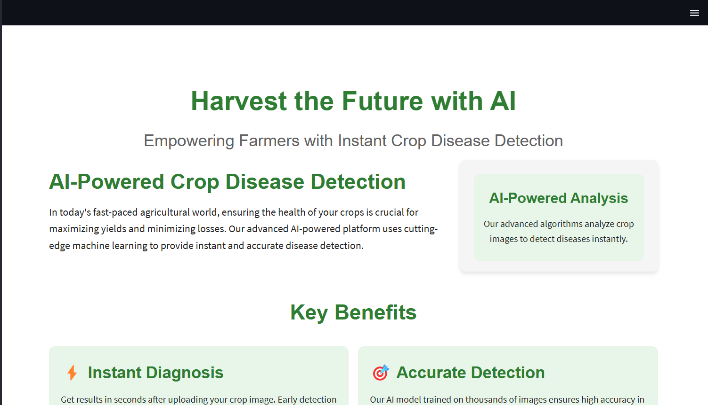
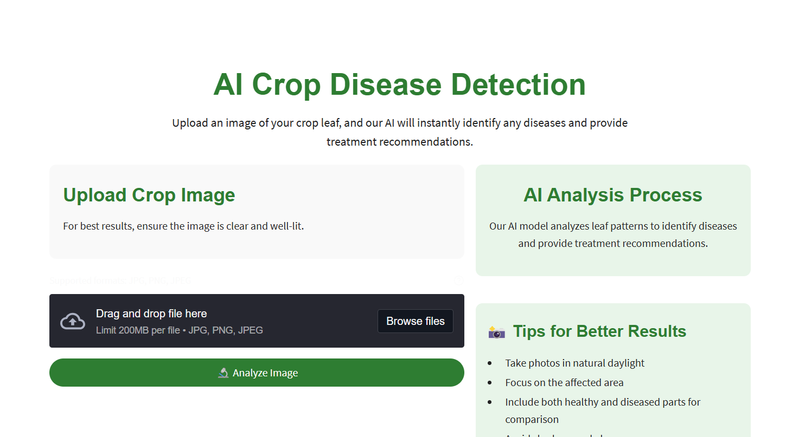
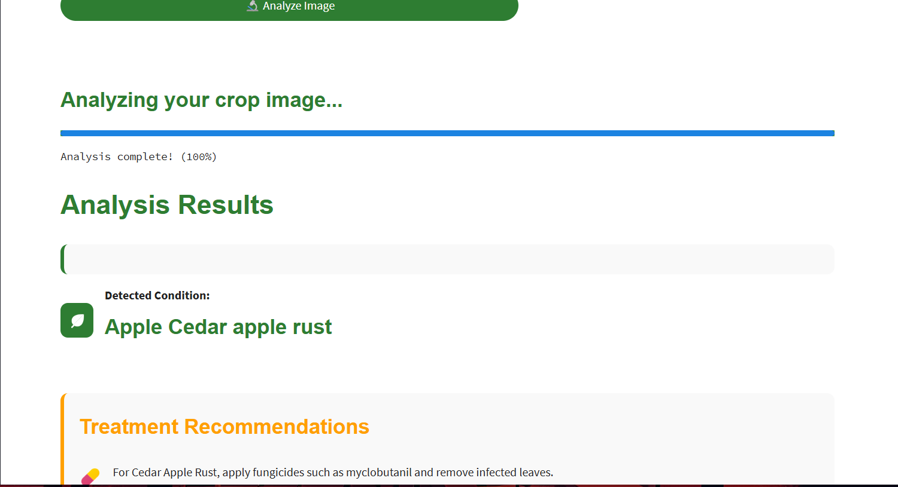
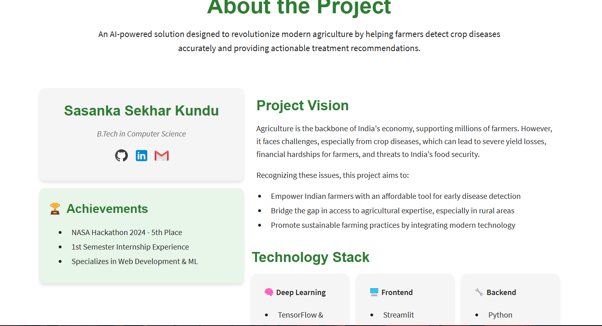

#  AgriNext - AI Crop Disease Detection


> Empowering farmers with instant crop disease detection using artificial intelligence

## 📋 Overview

AgriNext is an AI-powered web application that helps farmers identify crop diseases from images of plant leaves. The application uses deep learning to analyze uploaded images and provides instant disease diagnosis along with tailored treatment recommendations.

## ✨ Features

- **Instant Disease Detection**: Upload crop leaf images and get results in seconds
- **High Accuracy**: Model trained on thousands of images with 95%+ accuracy
- **Treatment Recommendations**: Receive customized treatment suggestions
- **User-Friendly Interface**: Clean, intuitive design accessible on all devices
- **Multi-Crop Support**: Detection for 38+ diseases across various crop types

## 🛠️ Technologies Used

- **Frontend**: Streamlit, HTML, CSS
- **Backend**: Python, TensorFlow, Keras
- **AI/ML**: Convolutional Neural Networks (CNN)
- **Image Processing**: PIL, NumPy
- **Data Visualization**: Streamlit components

## 🔍 Supported Crops & Diseases

The model can detect 38+ different classes of plant diseases including:

- Apple (Apple scab, Black rot, Cedar apple rust)
- Tomato (Early blight, Late blight, Leaf mold, Septoria leaf spot)
- Potato (Early blight, Late blight)
- Corn (Common rust, Northern Leaf Blight)
- Grape (Black rot, Esca/Black Measles)
- And many more...

## 🔧 Installation

### Prerequisites
- Python 3.8+
- pip package manager

### Setup Instructions

1. Clone the repository:
   ```bash
   git clone https://github.com/Sasanka14/AgriNext.git
   cd AgriNext
   ```

2. Create a virtual environment (optional but recommended):
   ```bash
   python -m venv venv
   source venv/bin/activate   # On Windows: venv\Scripts\activate
   ```

3. Install dependencies:
   ```bash
   pip install -r requirements.txt
   ```

4. Download the trained model:
   - Download `trained_plant_disease_model_save.keras` from the [releases page](https://github.com/Sasanka14/AgriNext/releases)
   - Place it in the project root directory

5. Run the application:
   ```bash
   streamlit run main.py
   ```

6. Open your browser and navigate to:
   ```
   http://localhost:8501
   ```

## 💻 Usage

1. Navigate to the **Disease Recognition** page
2. Upload a clear image of the crop leaf
3. Click on **Analyze Image** to process
4. View the disease detection results and treatment recommendations
5. Explore sample images to test the functionality

## 📊 Dataset

This project uses the **New Plant Diseases Dataset** from Kaggle, which includes:
- 38 different classes of healthy and diseased plant images
- Over 20,000 training images across various crop types
- Clean, high-quality leaf images for optimal training

[Dataset Source on Kaggle](https://www.kaggle.com/datasets/vipoooool/new-plant-diseases-dataset/data)

## 🔮 Future Roadmap

- [ ] Mobile app deployment for Android and iOS
- [ ] Offline functionality for use in areas with limited connectivity
- [ ] Support for regional Indian languages
- [ ] IoT integration for automated monitoring
- [ ] Weather data integration for context-aware recommendations

## 📷 Screenshots

<table>
  <tr>
    <td></td>
    <td></td>
  </tr>
  <tr>
    <td></td>
    <td></td>
  </tr>
</table>


## 👨‍💻 Author

- **Sasanka Sekhar Kundu** - B.Tech, Computer Science
  - [GitHub](https://github.com/Sasanka14)
  - [LinkedIn](https://www.linkedin.com/in/sasanka-sekhar-kundu-b746072a7)
  - Email: sasankasekharkundu24@gmail.com

## 🙏 Acknowledgements

- [New Plant Diseases Dataset](https://www.kaggle.com/datasets/vipoooool/new-plant-diseases-dataset) creators
- [Streamlit](https://streamlit.io/) for the incredible web app framework
- [TensorFlow](https://www.tensorflow.org/) team for the deep learning tools
- [Bootstrap Icons](https://icons8.com/) for the beautiful icons

## 📄 License

This project is licensed under the MIT License - see the [LICENSE](LICENSE) file for details.

---

<p align="center">Made with ❤️ to empower Indian farmers</p>